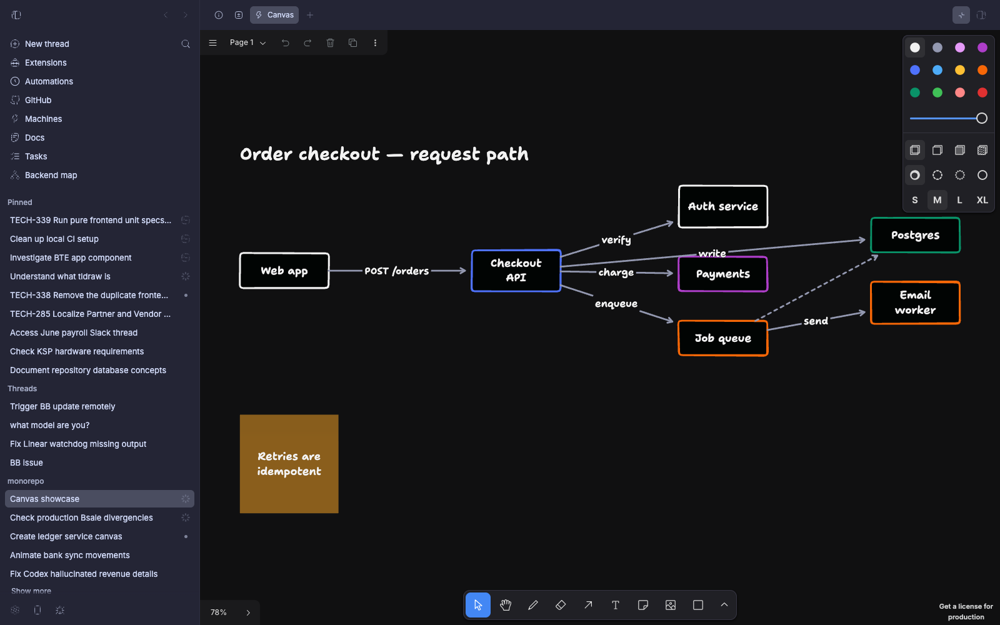

# Canvas

A BB plugin that gives every thread a shared [tldraw](https://tldraw.dev) canvas.
You draw on it, your agents draw on it, and both of you are looking at the same
board.



## What it does

- **A canvas panel per thread.** Open it from the thread's panel menu. It
  persists per thread, syncs across every client you have open (desktop, phone,
  a `bb connect` tunnel), and it is a full tldraw editor — draw, drag, annotate.
- **Agents draw on it.** The `canvas_draw` tool takes a small spec of nodes,
  edges and text. Boxes are sized to fit their labels and laid out
  automatically in layers that follow the arrows, so agents do not have to
  invent coordinates (and stop producing overlapping diagrams when they try).
- **Agents animate it.** A spec can carry `steps`: a timeline that adds shapes,
  slides boxes to new positions, flies the camera, pulses a node, sends a dot
  down an arrow and narrates each beat. Playback is local to whoever is
  watching; only the finished diagram is saved. The panel keeps a **Replay**
  button.
- **Agents read it back.** `canvas_read` returns what is on the board right
  now — including the shapes *you* added or moved — so a diagram is a
  conversation rather than a one-way render.

## Install

```sh
bb plugin install canvas
```

Or from a checkout:

```sh
bb plugin install /path/to/bb-plugin-canvas
```

## Using it

Ask for a picture: *"draw the request path"*, *"show me how these services
talk"*, *"animate what happens when a job fails"*. The bundled `canvas` skill
teaches agents the spec, the layout rules and the animation timeline.

By default nothing nags agents to use the canvas — the skill loads when it is
relevant. If you would rather every thread be told to prefer the canvas over
ASCII or Mermaid diagrams:

```sh
bb plugin config canvas set suggestEverywhere true
```

## How it fits together

- `server.ts` — queues each drawing batch per thread in the plugin's SQLite
  database, stores the canvas snapshot, registers the `canvas_draw` and
  `canvas_read` agent tools, and publishes realtime signals.
- `app.tsx` — the panel: a tldraw editor that applies queued batches, saves
  snapshots back, and reconciles concurrent edits from other clients.
- `layout.ts` — the layered auto-layout that places nodes and sizes boxes.
- `animate.ts` — timeline playback (steps, camera, pulses, flow dots, loops).
- `canvas-read.ts` — turns a stored snapshot into text an agent can read.
- `skills/canvas/SKILL.md` — how agents are taught to use all of the above.

Everything stays on your machine: the canvas lives in this plugin's local
database and the plugin makes no network requests.

## Licensing

This plugin's own code is MIT (see `LICENSE`).

It bundles the tldraw SDK, which is **not** open source. tldraw is distributed
under the [tldraw license](https://github.com/tldraw/tldraw/blob/main/LICENSE.md),
a verbatim copy of which is included as `LICENSE-tldraw.md`. In short: you may
use and modify it for development, and it may be bundled inside another
application, but production use requires a license from tldraw, and the
"made with tldraw" watermark must stay in place. If you are using this
commercially, talk to [tldraw](https://tldraw.dev) about a license.
